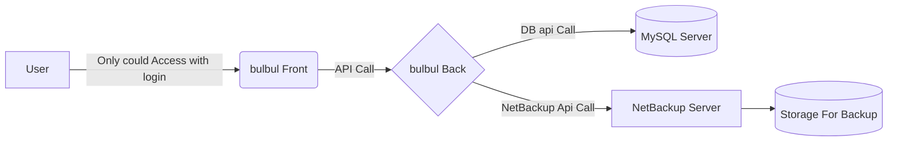
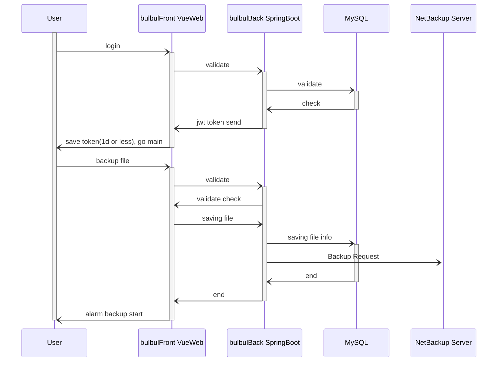

### 간략한 인프라 구성 (Flowchart)

```mermaid
flowchart LR
    A[User] --> 
    |Only could Access with login| B(bulbul Front)
    B --> |API Call| C{bulbul Back}
    
    C --> |DB api Call| D[(MySQL Server)]
    C -->|NetBackup Api Call | E[NetBackup Server]
    
    E --> F[(Storage For Backup)]
```

### 백업 시퀀스(Sequence Diagram)

```mermaid
sequenceDiagram
participant M as User
participant A1 as bulbulFront VueWeb
participant A2 as bulbulBack SpringBoot
participant A3 as MySQL
participant N as NetBackup Server

    activate M

    M-)+A1: login
    A1-)+A2: validate
    A2-)+A3: validate
    A3-)-A2: check
    A2-)-A1: jwt token send
    A1-)-M: save token(1d or less), go main

    M-)+A1: backup file
    A1-)+A2: validate
    A2-)A1: validate check
    A1-)A2: saving file
    A2-)+A3: saving file info
    A2-)+N: Backup Request
    A3-)-A2: end 
    A2-)-A1: end
    A1-)-M: alarm backup start

    deactivate M
```

Class Diagram
